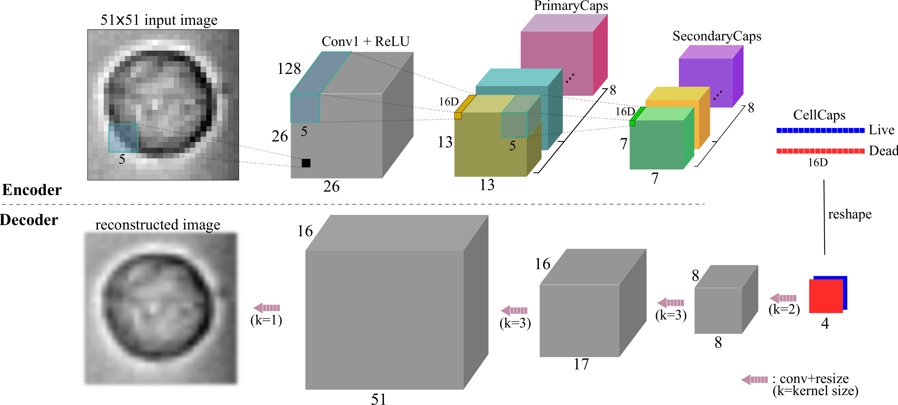

# Deep_Capsule_Network
Implementation of Deep Capsule Network using Convolutional Dynamic Routing

## Introduction
This repository contains the code for our paper titled "Automated Classification of Apoptosis in 
PhaseContrast Microscopy Using Capsule Network" (link to the paper will be provided after acceptance).



*Fig1. Example Deep Capsule Network architecture used in the paper*

## Load Your Data
Data loaders are provided for MNIST and CIFAR-10 data sets. You may load your data by modifying 
the provided data loaders or creating your own loader following the similar structure.

## Hyper-parameter Tuning
You may change any of the hyper-parameters provided in ```config.py```. 
For example, to to run the deep capsule network in train mode with batch size of 128,
run the following command in terminal:

```python main.py --mode=train --model=deep_capsule --batch_size=128```


